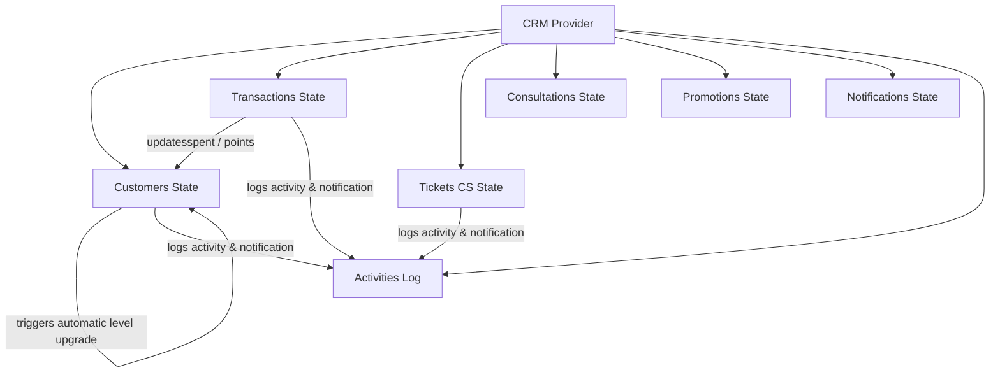

# FurniCraft CRM System

Premium Customer Relationship Management (CRM) dashboard designed for **FurniCraft**, a luxury furniture studio. The application is built with a sophisticated **Warm Minimalist / Beige Luxury** aesthetic, providing a professional and premium administrative interface to manage customers, sales, loyalty programs, design consultations, support tickets, and marketing promotions.

---

## 🎨 Theme & Design System
FurniCraft CRM implements a premium warm minimalist design system with the following palette tokens:
* **Rich Walnut Wood (Primary):** `#79553D` — Used for main brand accents, focus rings, and primary action buttons.
* **Warm Cream (Primary Light):** `#A67C52` — Used for subtle icons, borders, and brand highlighting.
* **Sand Beige (Background Tint):** `#FAF6F3` / `#FAFAF8` — Used for secondary cards and clean section dividers.
* **Charcoal Wood (Text Dark):** `#2B2420` — Used for headings, body copy, and high-emphasis elements.
* **Earthy Muted (Text Muted):** `#8A817A` — Used for descriptive texts, labels, and icons.

---

## 🛠️ Technology Stack
* **Vite + React 19:** Next-generation frontend tooling and rendering engine.
* **Tailwind CSS v4:** Modern utility-first styling for premium responsive layout design.
* **React Router v7:** Client-side declarative routing with lazy-loaded page modules.
* **Recharts:** Responsive and high-performance SVGs for business KPI charts.
* **React Icons:** Icon library utilizing standard `react-icons/fi` (Feather Icons).
* **Axios:** For handling auth and API requests.

---

## 🏗️ State Management & Connected Logic
The system features a centralized data store (`src/context/CRMContext.jsx`) managing all state nodes with fully reactive side effects, using React hooks (`useState`, `useRef`, `useEffect`):



### Connected Workflows:
1. **Order Creation:** Adding an order calculates totals, increases the customer's total spent, awards loyalty points, automatically updates their membership tier based on thresholds, and generates system activities & notifications.
2. **Membership Upgrade:** Promoting a customer manually or automatically records logs in their history tab, updates the membership dashboard KPI counters, and pushes live timeline feeds.
3. **Unified Global Search:** The search input in the header queries customer accounts and order records simultaneously, providing direct click-to-navigate links.
4. **Local Storage Persistence:** All updates auto-save to `localStorage` via `useEffect`, ensuring data persists across page reloads.

---

## 🧩 Reusable UI Components
The application features **16 custom UI components** located in `src/components/ui/`:

1. **`DataTable`:** Renders custom lists with columns definition, click-to-row handlers, and fallback empty states.
2. **`Pagination`:** Renders next/prev page buttons with items-count summaries.
3. **`StatCard`:** Displays KPIs with icon placeholders, title labels, and numeric trend indicators (up/down delta).
4. **`StatusBadge`:** Maps order stages and ticket states into colored pastel pills.
5. **`MembershipBadge`:** Styled badges representing loyalty tiers (Bronze, Silver, Gold, Platinum, VIP).
6. **`SearchInput`:** Clean minimalist search bar with icon accent.
7. **`DetailCard`:** Wraps information details with a title header and flex layout.
8. **`TabsComponent`:** Tab navigator with active underlines for multi-view panels.
9. **`EmptyState`:** Styled placeholder for empty search results or lists.
10. **`FilterDropdown`:** Select wrappers for filtering list tables.
11. **`ActivityItem`:** Timeline log card rendering purchase, consultation, membership, or complaint icons.
12. **`Avatar`:** User profile initials generator with elegant round shape.
13. **`Modal`:** Overlay dialog card with backdrop click handles and clean close actions.
14. **`NotificationItem`:** Notification pill showing read/unread states.
15. **`InfoRow`:** Formatted rows displaying key-value data fields.
16. **`PipelineStepper`:** Horizontal/vertical tracker mapping customer stages: `New Lead` ➔ `Contacted` ➔ `Proposal` ➔ `Negotiation` ➔ `Won`.

---

## 🧭 Project Page Modules

### 1. Dashboard (`/`)
* Displays KPI stats: Total Customers, Member Aktif, Revenue Bulan Ini, Total Orders.
* Segmented sub-KPIs for Sales, Products, and Members.
* Line and Bar Recharts mapping revenue trends, customer registrations, and product category shares.
* Top Customer leaderboard and real-time Activity Timeline Center.

### 2. Customers (`/customers`)
* Complete database list with multi-column filtering, search, and pagination.
* Add/Edit Customer modal to manage contact details, address, city, and loyalty tier.

### 3. Customer Profile (`/customers/:id`)
* **360° Profile View** featuring:
  * **Profil:** Contact card and registration logs.
  * **Timeline & Interaksi:** Communication logs with a quick-logger form for calls, emails, and meetings.
  * **Membership:** Reward points and progress indicators towards the next tier.
  * **Riwayat Pembelian:** Dynamic purchase history table.
  * **Komplain:** Active CS tickets filed by the customer.
  * **Catatan Admin:** Editable internal text block.
* Stage Pipeline Stepper to track customer status from Lead to Deal.

### 4. Transactions (`/purchase-history`)
* Complete purchase history showing Order Number, Customer, Products, Total Payment, and Status.
* Order Status levels: `Pending` ➔ `Processing` ➔ `Shipping` ➔ `Completed` ➔ `Cancelled`.
* **Detail Transaksi (`/purchase-history/:id`):** Displays customer info, list of purchased products with price/qty calculations, and order status upgrade actions.

### 5. Membership (`/memberships`)
* Loyalty metrics, tier distribution charts, and a member leaderboard.
* Manual tier upgrade dropdown modal.
* **Membership Detail (`/memberships/:id`):** Shows progression bar towards higher levels (e.g. Bronze ➔ Silver ➔ Gold ➔ Platinum ➔ VIP), target spending guidelines, and customized tier benefits list.

### 6. Customer Service (`/customer-service`)
* Support ticket logs for *Pertanyaan Produk*, *Keluhan Produk*, *Pengiriman*, *Garansi*, and *Retur*.
* Ticket Status states: `Open` ➔ `In Progress` ➔ `Resolved` ➔ `Closed`.
* Modal to open new support tickets directly.
* **Ticket Detail (`/customer-service/:id`):** Full description of the issue, status stepper, and comment/reply thread log.

### 7. Consultation (`/product-consultation`)
* Tracks interior design project requests from customers.
* Stores Room Type, Size (sqm), Budget range, and Design Preference (*Minimalis*, *Scandinavian*, *Industrial*, *Modern*, *Japandi*).
* **Consultation Detail (`/product-consultation/:id`):** Displays estimate specs, design requirements, desainer recommendations logger, and finalized budget agreements.

### 8. Promotions (`/promotions`)
* Marketing campaign dashboard with coupon code stats (total, active, expired).
* Creates new discount vouchers, flash sales, and membership promos.
* **Promo Detail (`/promotions/:id`):** Tracks usage count against limits and shows coupon claim list.

### 9. Notifications (`/notifications`)
* Inbox to view system alerts. Tabs to filter by category (Order, Customer, Membership Upgrade, Ticket CS).
* Dynamic preview pane with a direct navigation link to the associated page.

---

## 🚀 Running the Project Locally

### Install Dependencies:
```bash
npm install
```

### Start Development Server:
```bash
npm run dev
```

### Build Production Bundle:
```bash
npm run build
```

### Preview Production Build:
```bash
npm run preview
```
